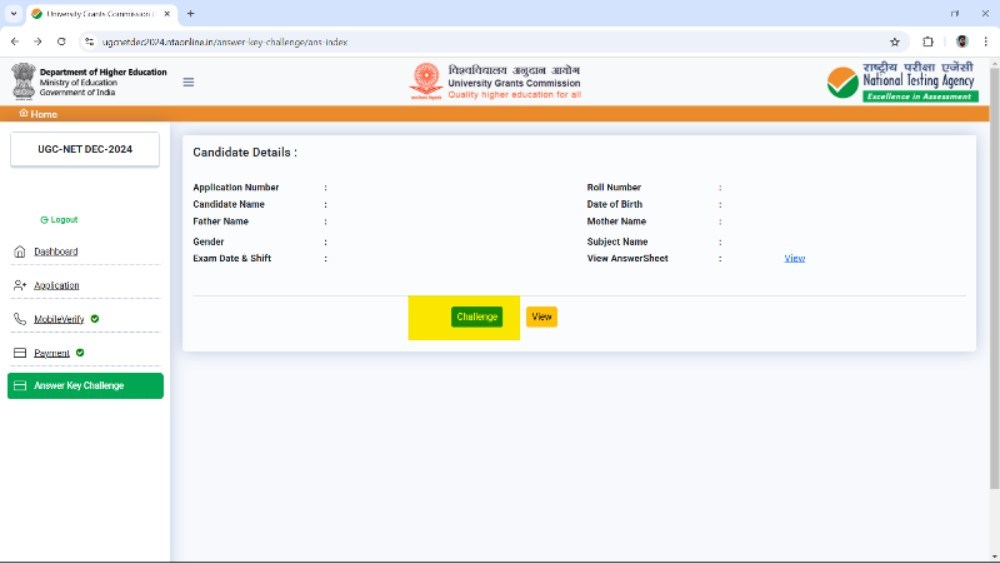
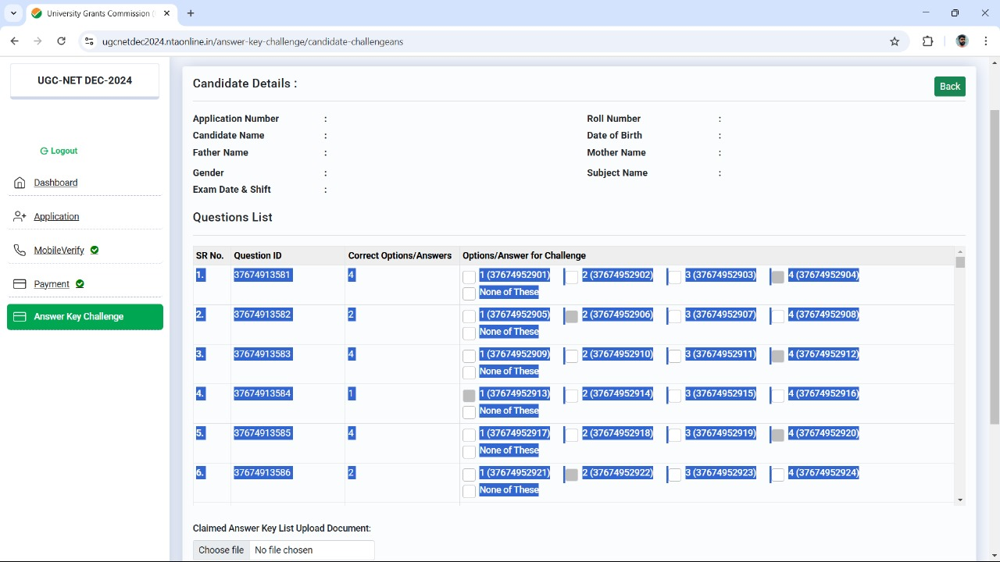
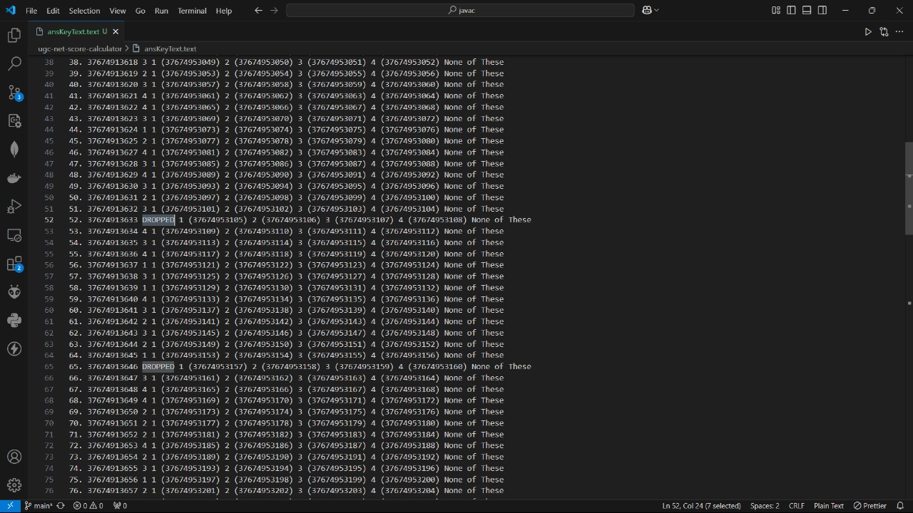
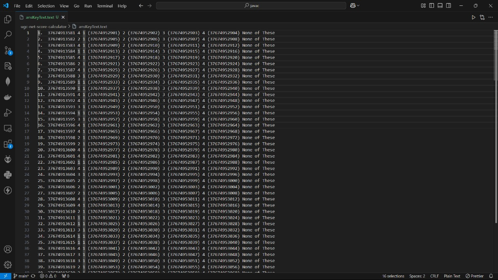
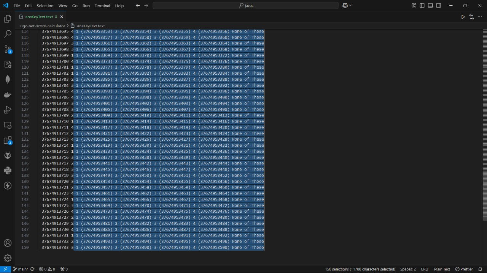
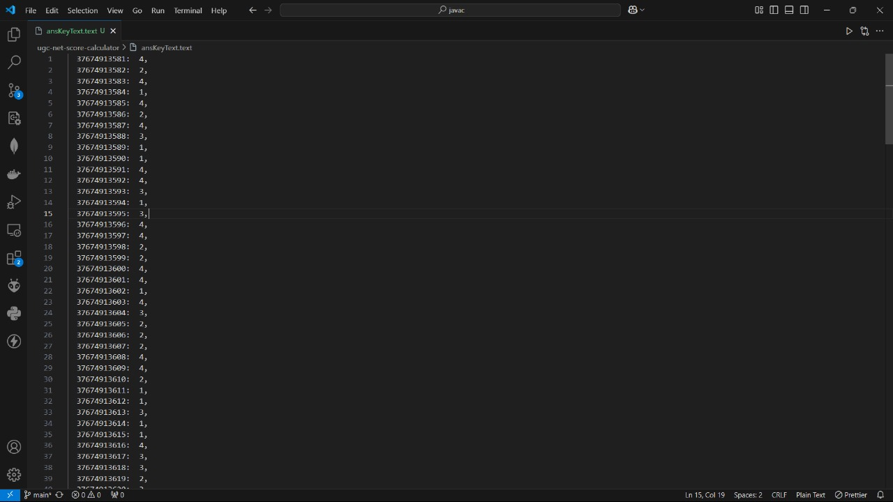
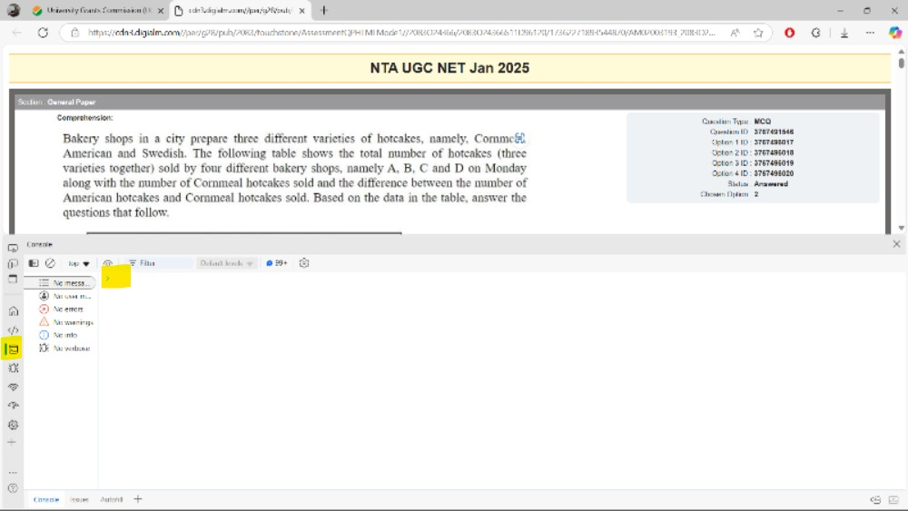

# UGC-NET Score Calculator

JavaScript code to calculate the score based on the released answer key and the chosen option by the student.

## Steps to Use

### 1. Click on the "Challenge Answer Key"



### 2. Copy the Answer Key

- Select all answers from the table.
- Copy them and paste them into a text file in VS Code.
  

### 3. Replace "Dropped" with "0"

- Double-click on "Dropped" to select it.
- Press and hold `Ctrl + D` to select all instances.
- Press `0` to replace them with "0".
- Alternatively, use `Ctrl + H` to open the Replace feature, then replace "Dropped" with "0".
  

### 4. Remove Serial Numbers and Format the Answer Key

- Bring your cursor to the beginning (top left) of the file.

- Press and hold `Ctrl + Alt + Down Arrow` to enable multi-cursor selection.
  

- Delete the serial numbers at the start of each line by pressing `Ctrl + Delete` twice.

- Move the cursor after the answer key by pressing `Ctrl + Right Arrow` twice.

- Delete all extra text after the answer key by selecting `Ctrl + Shift + End` and pressing `Delete`.
  

- Alternatively, use `Ctrl + Delete` 19 times to remove unwanted text.

- Add `,` at the end of each line.

- Move the cursor between the question ID and the answer key and insert a `:`.

The answer key is now ready to be pasted into the code.


### 5. Copy and Paste the Answer Key into the Code

- Select all (`Ctrl + A`), then copy (`Ctrl + C`).
- Open the JavaScript file and paste inside:

```javascript
const answerKey = {
  // Paste here
};
```

### 6. View the Submitted Answers Page

- Open the submitted answers page.
- Press `Ctrl + Shift + J` to open the browser console.
- Paste the script from `ugc-net-score-calculator/consoleScript.js` after updating the answer key array.
  

### 7. Allow Pasting in Chrome (if needed)

- If using Chrome and pasting is not allowed, type `allow pasting` in the console, hit Enter, then try pasting the script again and press Enter.

Your score will be calculated, displayed in the console and copied to clip board.
